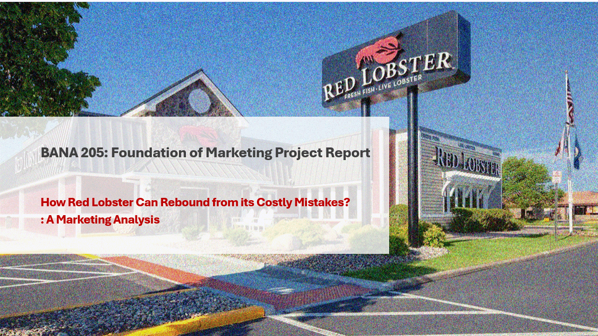

# Red Lobster Marketing Recovery Strategy

## Project Overview
This project presents a comprehensive marketing and operational recovery plan for Red Lobster following its May 2024 bankruptcy filing, which involved $1B in debt and the closure of 140 restaurants.
The analysis explores Red Lobster’s historical positioning, identifies the root causes of its financial decline, and delivers a phased action plan designed to restore profitability, brand equity, and customer loyalty.

## Objectives
- Analyze Red Lobster’s market position, operations, and competitive environment.
- Identify the primary marketing and operational challenges causing decline.
- Develop actionable, data-driven strategies to revitalize the brand.

## Situation Analysis
### Key Issues Identified:
- Pricing Missteps: The “$20 Ultimate Endless Shrimp” deal caused an $11M quarterly loss in 2023 and diluted brand value.
- Brand Erosion: Shift towards discount-heavy promotions undermined Red Lobster’s premium image.
- Operational Inefficiencies: Overworked staff, high attrition, poor adaptation to off-premise dining trends.
- Partnership Strain: Overreliance on Thai Union led to supply chain exclusivity and higher costs.

### Market Insights:
- Seafood restaurants represent 6.3% of U.S. chain restaurant revenue, indicating a niche yet resilient market.
- Competitors have adapted successfully post-pandemic via menu innovation, loyalty programs, and enhanced takeout experiences—areas where Red Lobster lagged.

## Proposed Solutions
Inspired by strategies from Olive Garden, Buffalo Wild Wings, Chipotle, and IHOP, the recovery plan includes:

### Pricing Reform
- Eliminate permanent discount promotions.
- Introduce seasonal & themed deals (e.g., Shrimply Irresistible Tuesdays).
- Apply differential pricing to shift demand to off-peak periods.
### Brand Repositioning
- Reinforce the brand mantra: “High quality, fresh seafood with an exceptional dining experience.
- Update restaurant interiors while keeping maritime charm.
- Launch creative marketing campaigns and loyalty app.
### Operational Upgrades
- Improve takeout and online ordering experience.
- Invest in staff training and retention programs.
- Enhance menu for off-premise dining compatibility.

## Action Plan & Timeline
### Quarter	Key Initiatives
- Q1	Audit operations, finalize pricing strategy, set revenue/NPS goals
- Q2–Q3	Launch promotions, redesign interiors, roll out loyalty app
- Q4	Monitor KPIs, refine campaigns, expand successful initiatives

## Expected Outcomes
- Brand revitalization with improved customer loyalty.
- Operational efficiency through optimized promotions and better staff management.
- Revenue growth via strategic pricing and enhanced dining experiences.
